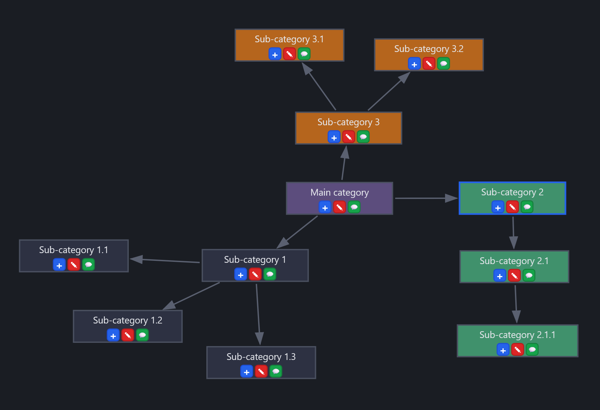
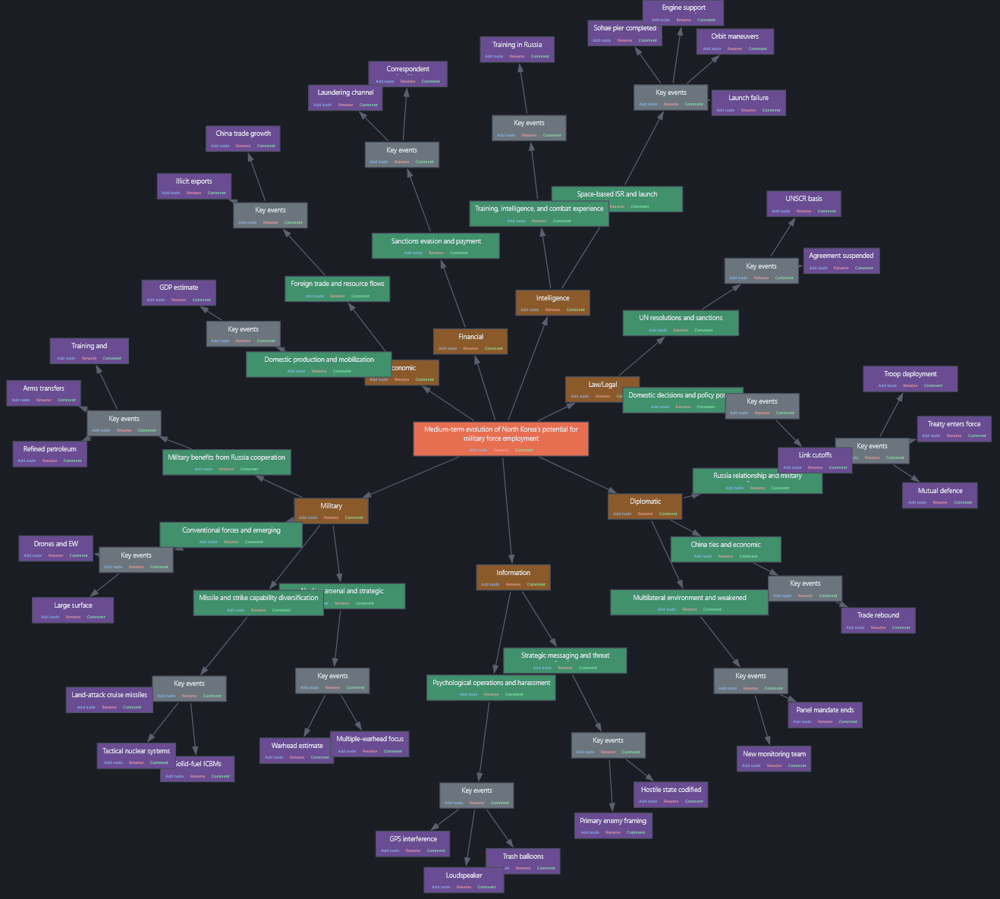
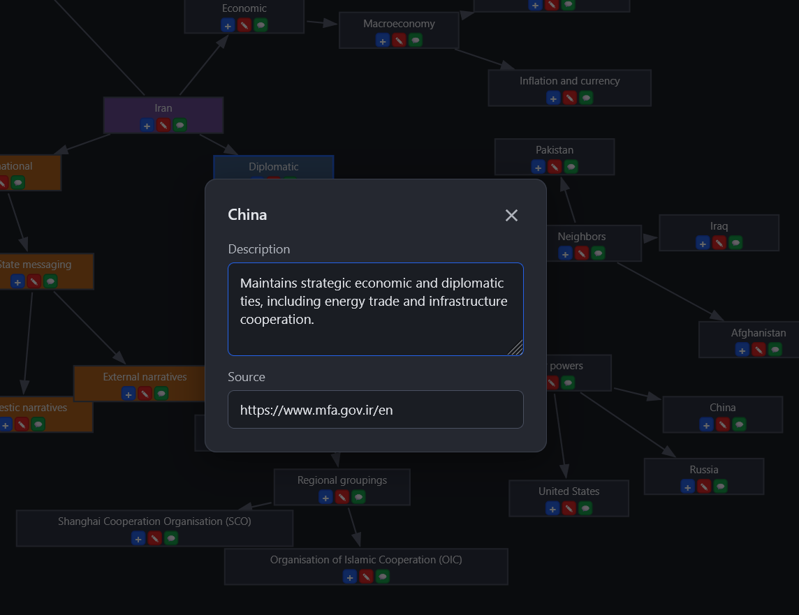

# Causal Map for Structured Analytic Techniques (SAT)

A lightweight, browser-based **causal map / concept-map editor** for Structured Analytic Techniques (SAT).  
It renders a hierarchical JSON dataset as an interactive node-link graph (SVG), supports node creation, editing, and annotation, and runs entirely in the browser with no backend required.

Runs offline, stores data in the browser during the session, and allows import/export of datasets as JSON.

---

## 📸 Features at a glance

- Interactive SVG causal map  
- Add, edit, and delete nodes  
- Node-level comments (description + source)  
- Color selection UI  
- Pan & zoom controls  
- Force-simulation “Float mode”  
- Session-based autosave  
- JSON import/export  


### Causal map overview

Shows a central main category branching into multiple sub-categories, with arrows indicating relationships and node action buttons for quick edits.

### Full map view  

Shows the complete causal map with nodes, arrows, toolbar, and navigation controls.


### Comment / annotation popup  

Displays the fields for **Description** and **Source** that can be attached to any node.

---

## 🔍 What it does

- Visualizes a **tree-structured JSON** dataset as an interactive causal/concept map
- Allows **adding sub-nodes** under any node using the “+” button
- Supports **editing nodes** (rename, recolor, delete)
- Provides a **comment popup** for each node (💬 icon):
  - **Description** — free-text contextual note
  - **Source** — URL or reference
- Offers smooth **pan & zoom** navigation + “Center View”
- Includes **Float mode** — a force-directed physics simulation for exploration
- Lets you **Import JSON** and **Export JSON** through the File menu
- Runs entirely client-side; no server or dependencies

---

## 🚀 Quick start

**From repo root:** Run `node start-all.js` and open the hub at http://localhost:3000, then click **Causal Map** (port 8080).

### Option 1: Open directly  
1. Clone or download the repository  
2. Open `index.html` in your browser

### Option 2: Serve locally (recommended)  
Some browsers limit features over `file://`. To avoid issues:

```bash
python -m http.server 8000
```

Then open:  
👉 http://localhost:8000

### Option 3: Auto-save hypothesis keywords to the circleboarding folder  
To have **Generate Hypothesis Keywords** / **Create Keywords** append directly to  
`data/hypothesis_keywords.jsonl`  
without any save dialog, run the included Node.js server from this folder:

```bash
cd 01-getting-organized/structured-analytic-causal-map
node server.js
```

Then open:  
👉 http://localhost:8080  

When you click **Create Keywords** (in the keywords popup), the record is appended to the JSONL file automatically (no prompt).  
If you open the app without the server (e.g. by double-clicking `index.html`), the app will fall back to a download or save dialog.

---

## 📋 Workflow tips

- The main way of working is **bottom-up**: start from a blank map and build it node by node, or prepare your own JSON and use **File -> Import JSON**.
- **Save and use in other tools** — When you finish your project, use **File → Save** to export your map as JSON. You can upload that JSON into the next analysis tool: the same format is supported in **Timeline** and **ACH** (Analysis of Competing Hypotheses). If you have used **Generate Hypothesis Keywords**, the keywords are appended to `data/hypothesis_keywords.jsonl` in the **repo root**; you can upload or use that file from the circleboarding tool’s UI.

---

## 💾 Data storage

- All map data is stored temporarily using **sessionStorage**
- There is **no backend or database**
- Data persists only for the browser session
- Use **File → Save (Export)** to store or share your dataset as JSON

---

## 📦 JSON format (import/export)

The app loads and saves a **hierarchical node tree** with:

| Field         | Type   | Required | Notes |
|--------------|--------|----------|-------|
| `id`         | string | Yes      | Unique identifier |
| `label`      | string | Yes      | Node name |
| `children`   | array  | Yes      | Child nodes |
| `description`| string | No       | Shown in comment popup |
| `source`     | string | No       | URL or reference |
| `color`      | string | No       | Hex color for node box |
| `x`, `y`     | number | No       | Stored positions |

### Example (excerpt)

```json
{
  "id": "iran",
  "label": "Iran",
  "children": [
    {
      "id": "iran-diplomatic",
      "label": "Diplomatic",
      "children": [
        {
          "id": "iran-diplomatic-bilateral-major-powers-china",
          "label": "China",
          "description": "Maintains strategic economic and diplomatic ties, including energy trade and infrastructure cooperation.",
          "source": "https://www.mfa.gov.ir/en",
          "children": []
        }
      ]
    }
  ]
}
```

---

## Input / output (import vs export)

**Import:** JSON file with a **hierarchical tree**. Each node can use `label` or `name` (both accepted); `id`, `children` (array), and optionally `description`, `source`, `color`, `evidence`, `date`, `time`, `depth`.

**Export:** Same tree structure. The app exports using `name` (not `label`); empty `description`/`source`/`date`/`time` are omitted. Default download filename: `causal_map.json`.

**Example export (one node):**

```json
{
  "id": "root-1",
  "name": "Main topic",
  "depth": 0,
  "evidence": "",
  "children": [
    {
      "id": "child-1",
      "name": "Sub-topic",
      "depth": 1,
      "evidence": "Yes",
      "children": [],
      "color": "#6c757d",
      "description": "Context note",
      "source": "https://example.com",
      "date": "2025-01-15",
      "time": "12:00"
    }
  ]
}
```

---
