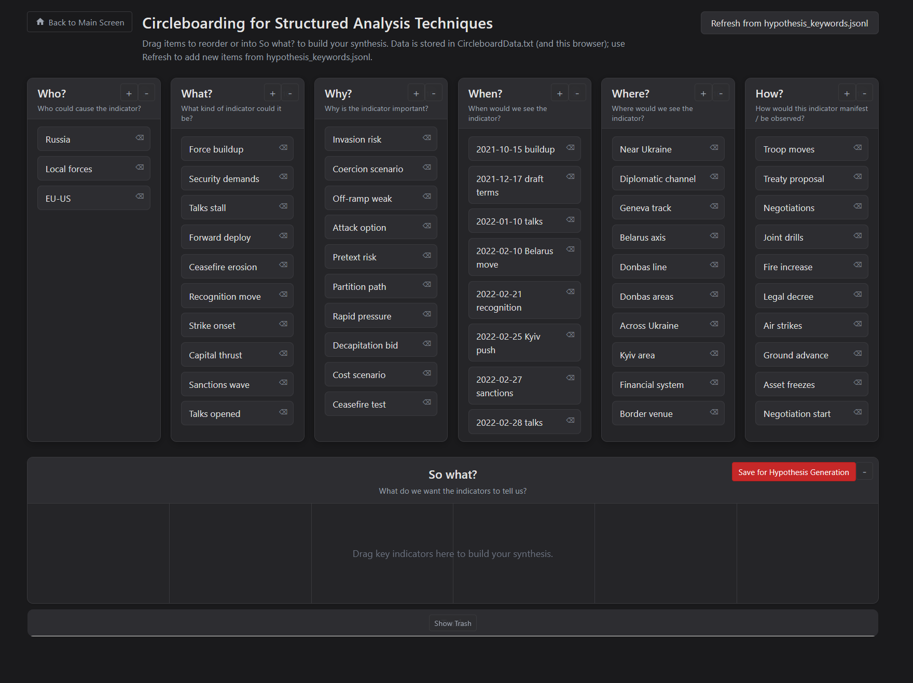

# Circleboarding

Kanban-style 5W+H board with a 6-lane "So what?" synthesis area.

## Run

- Via hub: run `node start-all.js` at repo root, then open `http://localhost:3000` and launch Circleboarding.
- Standalone: in this folder run `node server.js`, then open `http://localhost:8082`.

## File button behavior

- **Update from File**: reads `data/hypothesis_keywords.jsonl` on the local server.
- **Import**: reads a local JSON file selected by the user.
- **Export**: downloads current board state as `circleboard_export.json`.
- **Clear**: clears the current board view (does not read a file).

## Other save output

- **Save for Hypothesis Generation** writes:
  - `03-diagnostics/structured-analytic-multiple-hypothesis-generation/input/Multiple_Hypothesis_Generation.txt`
  - format: plain text list under `So What?`.

## Data notes

- Main persisted state file (when server is running): `CircleboardData.txt`
- Browser fallback persistence: `localStorage`
