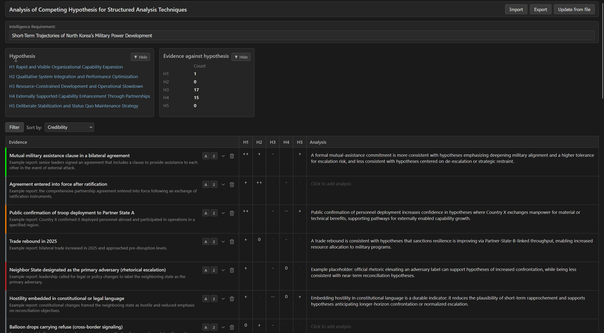

# Analysis of Competing Hypothesis (ACH) - Evidence List

Single-page tool for building and editing an ACH matrix: evidence rows vs hypothesis columns (H1-H5), with analysis notes and JSON persistence.



## Run

1. In this folder:

```bash
node server.js
```

2. Open `http://localhost:8084`.

From repo root, you can also run `node start-all.js` and open the hub at `http://localhost:3000`.

## Core functions

- Evidence matrix editing (H1-H5 ratings + analysis text per row)
- Evidence detail editing (name, description, source, date/time, reliability, credibility, color)
- Add new evidence rows
- Evidence filtering/sorting and optional custom row order
- Evidence import/export JSON
- Hypothesis list editing and save/update/import/export

## Actual file usage (current implementation)

| Path | Role | Notes |
|---|---|---|
| `../../data/evidence.json` | Primary evidence tree | Default load source and save target for evidence. |
| `evidence_list.jsonl` | Flattened evidence list | Regenerated when evidence is saved (only nodes with `evidence: "Yes"`). |
| `hypothesis_example.json` | Local hypothesis file | Used by initial hypothesis load and hypothesis import save. |
| `input/hypothesis.json` | Input hypothesis file endpoint | Writable via API (`/api/save-input-hypothesis`). |
| `../../data/hypothesis.json` | Shared hypothesis file | Used by hypothesis **Update** and save endpoint `/api/save-data-hypothesis`. |

## Important behavior notes

- **Read Evidence from File** uses default `data/evidence.json`.
- **Update from file** for evidence can load a user-entered JSON filename; that filename is remembered in `localStorage` (`ach-update-filename`).
- **Saving evidence** writes to `../../data/evidence.json` and refreshes `evidence_list.jsonl`.
- **Hypothesis initial load** reads `hypothesis_example.json`.
- **Hypothesis Update button** reads `../../data/hypothesis.json` via `/api/hypothesis`.
- **Import Hypothesis** currently saves to `hypothesis_example.json` via `/api/save-hypothesis`.

## Server API (implemented)

- `POST /api/save-evidence` -> writes `../../data/evidence.json` and `evidence_list.jsonl`
- `POST /api/remove-from-evidence-jsonl` -> removes one row by `id` from `evidence_list.jsonl`
- `POST /api/save-hypothesis` -> writes `hypothesis_example.json`
- `POST /api/save-input-hypothesis` -> writes `input/hypothesis.json`
- `GET /api/evidence` -> returns `../../data/evidence.json`
- `GET /api/hypothesis` -> returns `../../data/hypothesis.json`
- `POST /api/save-data-hypothesis` -> writes `../../data/hypothesis.json`

## Data format summary

### Evidence tree (`data/evidence.json`)

Root object with nested `children`. Each evidence node may include:

- `id`, `name`, `description`, `source`, `date`, `time`
- `source_reliability`, `source_credibility`
- `color`, `evidence`
- `H1`, `H2`, `H3`, `H4`, `H5`
- `analysis_description`
- `children` (array)

### Hypothesis object (`hypothesis_example.json` or `data/hypothesis.json`)

Object keyed by slot and/or metadata, for example:

- `intelligence_requirement`
- `H1` ... `H5` as objects (`id`, `title`, `description`)

## Port

- App port: **8084**
