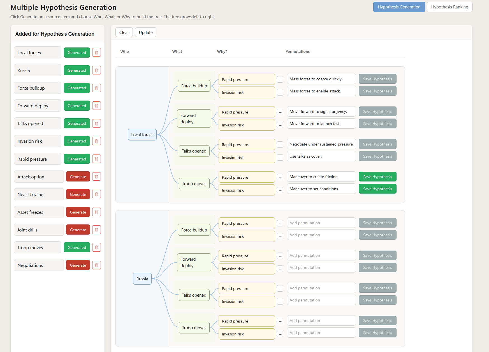
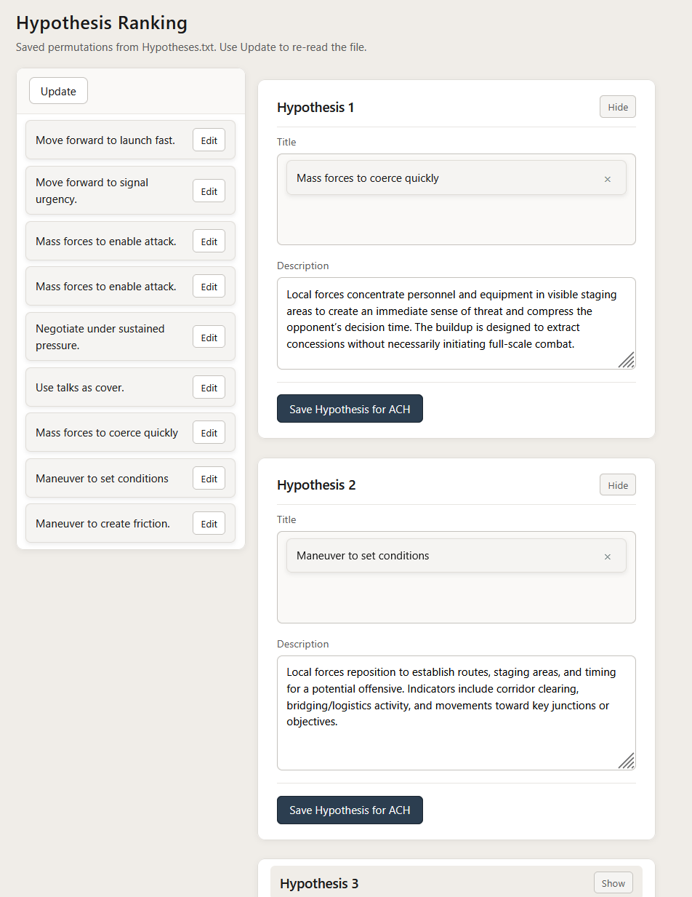

# Multiple Hypothesis Generation

This module has two main views, switched by the top buttons: **Hypothesis Generation** and **Hypothesis Ranking**.

- **Hypothesis Generation**: Build a tree from source items by choosing **Who?**, **What?**, or **Why?** for each item. The left panel lists source items, and the right panel shows columns (**Who -> What -> Why -> Permutations**) with editable cards.
- **Hypothesis Ranking**: Rank and assign hypotheses into five slots (**H1-H5**). The left panel loads hypotheses from `data/hypothesis.json`, and the right panel contains H1-H5 cards.

## Screenshots

**Hypothesis Generation**

**Hypothesis Ranking**

## Running the app

- **Via hub:** From repo root run `node start-all.js`, open `http://localhost:3000`, then open this app.
- **Standalone:** In this folder run `node server.js`, then open `http://localhost:8083`.

## Files and paths

| Path | Used for | Notes |
|---|---|---|
| `input/Multiple_Hypothesis_Generation.txt` | Generation source list | Read by **Update** in generation view; created/updated by this app and Circleboarding flow. |
| `Hypotheses.txt` | Legacy plain-text hypothesis list | Still writable via API endpoints, but ranking view currently loads from `data/hypothesis.json`. |
| `../../data/hypothesis.json` | Primary hypothesis store | Used by ranking view and ACH handoff (`hypotheses[]`, `H1..H5`, `intelligence_requirement`). |
| `../../data/hypothesis_keywords.jsonl` | Hypothesis keyword JSONL output target | Server prints this path on startup. |

## Current data flow

1. Generation source items are loaded from `input/Multiple_Hypothesis_Generation.txt`.
2. Clicking **Save Hypothesis** on a permutation sends `/api/save-hypothesis` and adds that title to `../../data/hypothesis.json` under `hypotheses[]` (deduplicated by title).
3. Ranking view loads from `/api/hypothesis-ach` (backed by `../../data/hypothesis.json`).
4. **Save Hypothesis for ACH** writes selected card content to `H1..H5` in `../../data/hypothesis.json` via `/api/save-hypothesis-ach`.

## ACH output shape (current)

`../../data/hypothesis.json` may contain:

- `intelligence_requirement`
- `hypotheses`: array of `{ id, title, slot?, description? }`
- `H1`, `H2`, `H3`, `H4`, `H5`: each as `{ id, title, description, hypothesisId? }`

## Port

This app uses **port 8083**.

See also: repo root `HUB-PAGE-INSTRUCTIONS.md`.
