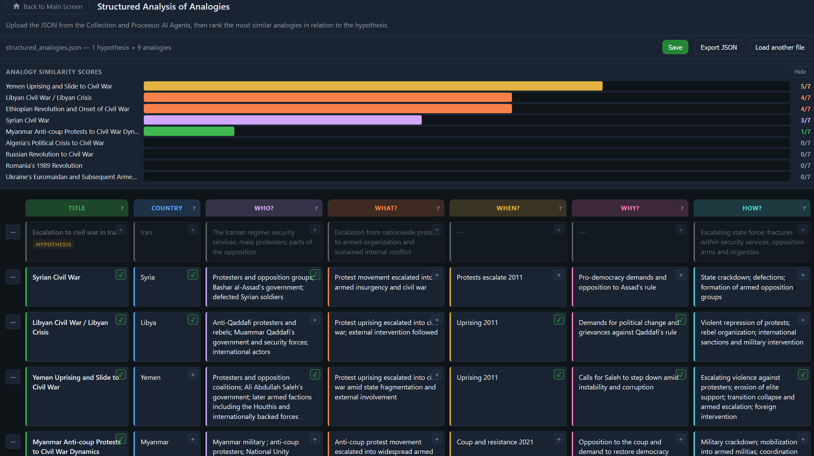

# Structured Analysis of Analogies



Browser-based tool for comparing historical analogies against a hypothesis with field-by-field similarity scoring.

## Run

No backend is required.

- Open `index.html` in a browser (directly or via the hub).
- Upload a JSON file to begin.

## Core functions

- Upload JSON array of hypothesis + analogies
- Score each row across seven fields (`Title`, `Country`, `Who`, `What`, `When`, `Why`, `How`)
- Live scoreboard (`0-7`) ranking analogies by similarity score
- Collapse/expand rows for faster review
- Open detail modal for full text, sources, and editable notes
- Export JSON (without `Sources` field)
- Session restore via `sessionStorage`

## Actual behavior notes

- First row in uploaded JSON is treated as the **Hypothesis** and rendered in muted style.
- **Save** button does **not** write to disk or server; it confirms and preserves the in-memory/session state.
- **Export JSON** downloads `analogies-export.json` and removes `Sources` from each entry.
- **Load another file** resets the current session and returns to the upload screen.

## Expected JSON format

Input must be a JSON array. Typical keys:

- `Title`
- `Description`
- `Country`
- `WHO was the target?`
- `WHAT happened?`
- `WHEN did it happen?`
- `WHY did this happen?`
- `HOW did it happen?`
- `Sources` (array of URLs)
- `Notes`

Example:

```json
[
  {
    "Title": "Hypothesis title",
    "Description": "Working hypothesis",
    "Country": "Country",
    "WHO was the target?": "...",
    "WHAT happened?": "...",
    "WHEN did it happen?": "...",
    "WHY did this happen?": "...",
    "HOW did it happen?": "...",
    "Sources": ["https://example.com"],
    "Notes": ""
  }
]
```

## Files in this folder

| File | Purpose |
|---|---|
| `index.html` | Entire app (UI + logic) |
| `assets/img/analogies-ui.png` | README screenshot |

## Notes for integration

This tool does not currently call repository APIs. It is intended as a local, upload-and-score step in the reframing workflow.

Part of the [Structured Analytic Techniques](../../README.md) toolkit.
