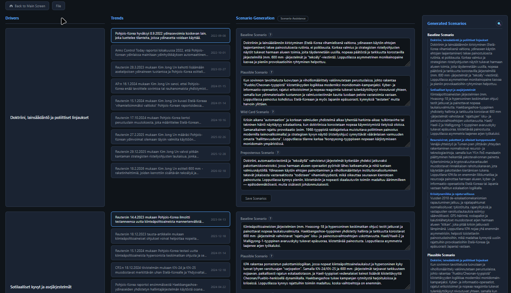

# Cone of Plausibilities

Browser-based foresight tool for generating four scenario types from evidence-derived drivers and trends:

- Baseline
- Plausible
- Wild Card
- Preposterous



## Run

Run from repo root:

```bash
node start-all.js
```

Then open the hub at `http://localhost:3000` and launch **Cone of Plausibilities**.

Default app URL from the hub flow:

- `http://localhost:3000/05-foresight/structured-cone-of-plausibilities/index.html`

## Core functions

- Reads drivers/trends from evidence data
- Lets you write scenario text per driver across 4 scenario types
- Saves scenario text to shared scenarios storage
- Shows generated scenario overview panel (with expand view)
- Supports trend detail editing (name, source, date, evidence, H1-H5, analysis)
- Includes File menu: Read from File, Import JSON, Export JSON

## Data behavior (current implementation)

Load priority is:

1. `scenarios.json` (via `/api/load-scenarios`)
2. fallback to `data/evidence.json`

When fallback is used, the app seeds `scenarios.json` from evidence-derived structure so future reads use scenarios data.

All scenario edits are persisted to scenarios storage via `/api/save-scenarios`.

Trend modal edits also persist through scenarios save flow (not back to evidence).

## File menu behavior

- **Read from File**: Reloads using the load-priority logic above.
- **Import JSON** supports two formats:
  - scenarios array format (same as app export)
  - evidence root object format (object with `children`)
- **Export JSON**: Downloads current scenarios as `cone-of-plausibilities.json`.

## External dependency used in UI

- Optional Scenario Assistance link:
  - `https://chatgpt.com/g/g-69963f07809c8191b528296b10d0f9eb-cone-of-plausibility-agent`

## Files in this folder

| File | Purpose |
|---|---|
| `index.html` | Entire app (UI + logic) |
| `README.md` | This documentation |

## Screenshot file reference

Use this filename for the README screenshot:

- **`cone-ui.png`**

Place it at:

- `05-foresight/structured-cone-of-plausibilities/assets/img/cone-ui.png`

## Notes

- This tool expects the repo hub/server environment to provide `/data/evidence.json`, `/api/load-scenarios`, and `/api/save-scenarios`.
- If neither scenarios nor evidence can be loaded, the page shows a load error message.
