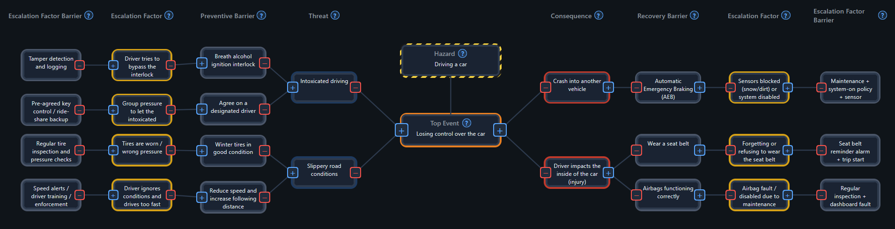

# Bowtie Analysis Tool

Lightweight browser tool for building a Bowtie structure around a **Top Event** with:

- **Threats** on the left
- **Consequences** on the right
- **Barriers**, **Escalation Factors**, and **Escalation Factor Barriers** at deeper levels



## Verified status

A runtime smoke test was run against the current implementation:

- server started on `http://localhost:8085`
- main page loaded (`200 OK`)
- expected UI controls exist (`File`, `Import JSON`, `Download JSON`)

## Run

From this folder:

```bash
node server.js
```

Open:

- `http://localhost:8085`

Or run from repo root:

```bash
node start-all.js
```

and open the hub at `http://localhost:3000`.

## What it does

- Creates a nested Bowtie structure around a fixed root Top Event
- Supports both Bowtie sides:
  - Left: Threat -> Preventive Barrier -> Escalation Factor -> Escalation Factor Barrier
  - Right: Consequence -> Recovery Barrier -> Escalation Factor -> Escalation Factor Barrier
- Includes a Hazard node above the Top Event
- Auto-reflows node layout as children are added
- Supports pan/zoom and direct text editing
- Provides lane/type help tooltips

## File menu

- **Import JSON**: Load a saved Bowtie JSON file
- **Download JSON**: Export current Bowtie structure as JSON

## Screenshot file reference

Use this filename for the README screenshot:

- **`bowtie-ui.png`**

Place it at:

- `06-decision-support/structured-bowtie-analysis/assets/img/bowtie-ui.png`

## Files in this folder

| File | Purpose |
|---|---|
| `index.html` | Main Bowtie app (UI + logic) |
| `server.js` | Local static server on port 8085 |
| `assets/img/bowtie-ui.png` | README screenshot image |
