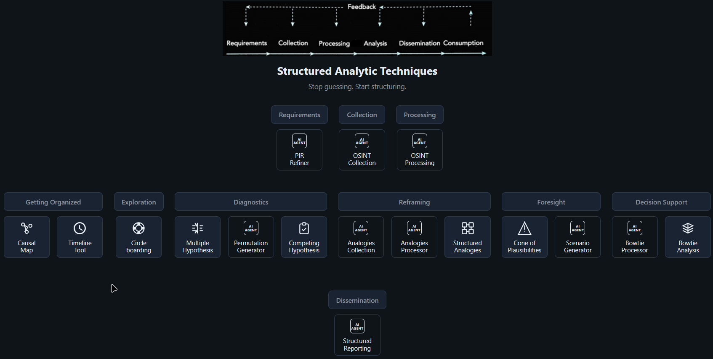

# Structured Analytic Techniques

*Structured Analytic Techniques for Intelligence Analysis - Heuer Jr., Pherson*

A collection of lightweight, analyst-focused tools for Structured Analytic Techniques (SAT). All tools run in the browser and work offline where applicable.

## Quick start

From the repo root run:

```bash
node start-all.js
```

Then open **http://localhost:3000** in your browser. The hub shows one button per tool; each opens the tool in a new tab. Press Ctrl+C in the terminal to stop all servers.

Alternatively, run **`node server.js`** from the repo root for the same result.

**Note:** The folder structure supports only one information requirement task. To avoid collision between different analyses, it is suggested that once downloaded the whole repository is moved into a dedicated project folder (for example one folder per case or task).

## Screenshot (hub / main page)


*Main hub with tool launcher buttons.*

## Purpose

These tools support practical SAT workflows: they make assumptions, relationships, and timelines explicit and help reduce cognitive bias. They are aimed at exploratory analysis in complex, uncertain settings without heavy infrastructure.

## Hub buttons (brief descriptions)

The hub is grouped by workflow phase. Some buttons open local tools, and some open external ChatGPT agents.

### Requirements
- **PIR Refiner** (ChatGPT agent): Refines and structures the intelligence requirement.

### Collection
- **OSINT Collection** (ChatGPT agent): Supports structured open-source collection planning.

### Processing
- **OSINT Processing** (ChatGPT agent): Supports processing and organization of collected material.

### Getting Organized
- **Causal Map** (`http://localhost:8765`): Builds and edits a causal node-link map; supports annotations and JSON import/export.
- **Timeline** (`http://localhost:8080`): Organizes events by time with metadata and export options.

### Exploration
- **Circleboarding** (`http://localhost:8082`): 5W+H ideation board with "So what?" lanes for exploratory synthesis.

### Diagnostics
- **Multiple Hypothesis** (`http://localhost:8083`): Generates and structures alternative hypotheses.
- **Permutation Generator** (ChatGPT agent): Produces hypothesis permutations and combinations.
- **Competing Hypothesis** (`http://localhost:8084`): ACH evidence matrix and hypothesis comparison workflow.

### Reframing
- **Analogies Collection** (ChatGPT agent): Collects candidate analogies for the case.
- **Analogies Processor** (ChatGPT agent): Processes and screens analogies before scoring.
- **Structured Analogies** (`04-reframing/structured-analysis-of-analogies/index.html`): Scores and compares analogies in-tool.

### Foresight
- **Cone of Plausibilities** (`05-foresight/`): Builds baseline, plausible, wildcard, and preposterous scenarios.
- **Scenario Generator** (ChatGPT agent): Supports drafting and refining scenario outputs.

### Decision Support
- **Bowtie Processor** (ChatGPT agent): Assists preparation and processing for Bowtie analysis.
- **Bowtie Analysis** (`06-decision-support/structured-bowtie-analysis/index.html`): Builds hazards, threats, barriers, and consequences in Bowtie form.

### Dissemination
- **Structured Reporting** (ChatGPT agent): Converts analytical outputs into structured reporting.

## Local tool ports

| Tool | Port | Folder |
|------|------|--------|
| Causal Map | 8765 | `01-getting-organized/structured-analytic-causal-map` |
| Timeline | 8080 | `01-getting-organized/structured-analytic-timeline` |
| Circleboarding | 8082 | `02-exploration/structured-analytic-circleboarding` |
| Multiple Hypothesis | 8083 | `03-diagnostics/structured-analytic-multiple-hypothesis-generation` |
| Competing Hypothesis (ACH) | 8084 | `03-diagnostics/structured-analysis-of-competing-hypothesis` |
| Bowtie Analysis | 8085 | `06-decision-support/structured-bowtie-analysis` |

Port details: [HUB-PAGE-INSTRUCTIONS.md](HUB-PAGE-INSTRUCTIONS.md).
